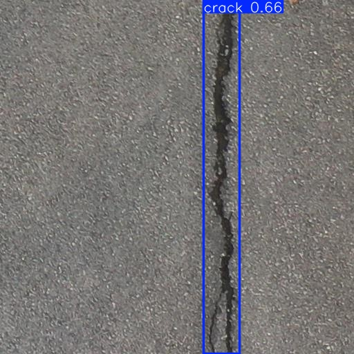
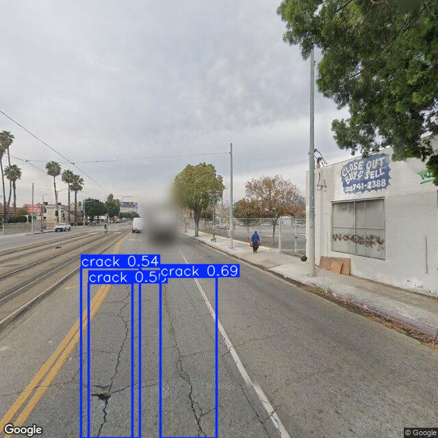
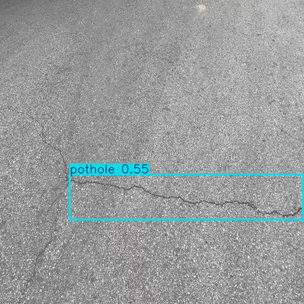
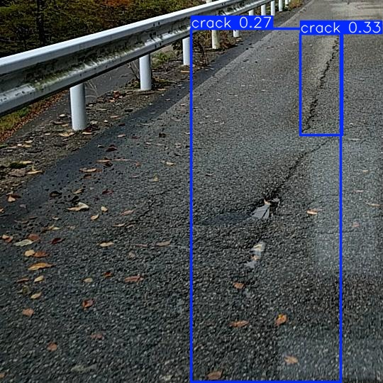
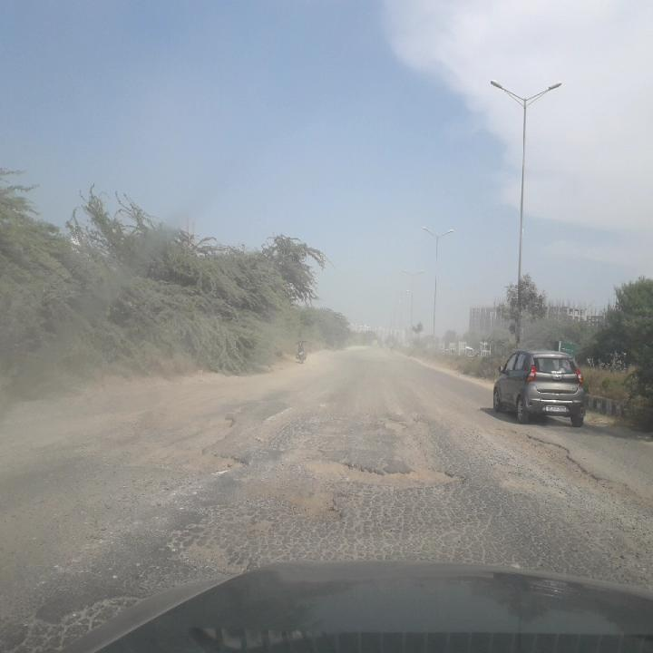

# Road Damage Detection using YOLOv8

 

An object detection system built with YOLOv8 for identifying cracks and potholes in road surface images. 

## Project Overview 
This project implements a computer vision pipeline for detecting road surface damage using YOLOv8 object detection model. 

The system identifies two primary road damage categories: 

- Cracks 
- Potholes 

The objective is to demonstrate an end-to-end deep learning workflow including dataset preparation, model training, prediction, and error analysis. 

---

## Dataset 

The project uses the **RDD (Road Damage Detection) dataset**, which contains annotated road images captured under various conditions. 

The dataset was simplified into two classes: 

- Crack
- Pothole

Dataset split:

- Training set
- Validation set
- Test set

---

## Model 

The object detection model used: 

**YOLOv8n (Ultralytics)**

YOLOv8n was selected because:

- lightweight architecture
- faster experimentation
- suitable for CPU training

Training configuration:

- Image size: 640
- Epochs: 20
- Framework: Ultralytics YOLOv8

---

## Model Evaluation 

Validation metrics: 

- Precision ≈ 0.60
- Recall ≈ 0.48
- mAP50 ≈ 0.51
- mAP50-95 ≈ 0.25

The model performs well in identifying crack patterns but struggles with pothole detection due to class imbalance. 

---

## Trade-offs & Limitations 

### Class Imbalance 
The dataset contains significantly more crack samples than pothole samples.

This causes the model to bias toward crack predictions.

### Crack–Pothole Confusion
Wide cracks sometimes resemble potholes visually, leading to classification confusion.

### Missed Potholes
Some potholes are missed due to limited representation in the training dataset.

---

## Example Predictions

### Crack Detection
The model correctly identifies longitudinal cracks.

### Multiple Crack Detection
The model detects multiple damage regions within the same image. 

### Crack Misclassified as Pothole
Wide cracks may sometimes be classified as potholes due to visual similarity. 

### Crack-Pothole Confusion
When potholes and cracks appear close together the model may classify both as cracks. 

### Missed Pothole Detection
Some potholes are missed due to limited pothole training samples. 

## How to Run

Install dependencies:

pip install ultralytics 

Run inference: 

yolo detect predict model=yolov8n.pt source=path_to image

---

### Technologies Used 

- Python
- YOLOv8 (Ultralytics)
- Computer Vision
- Object Detection 

